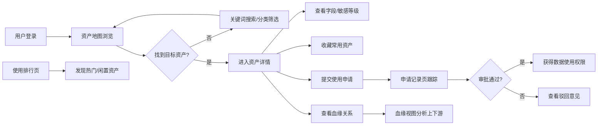

## 1. 产品概述

数据资产地图 Web 应用，帮助数据管理人员看清数据从哪里来、被谁使用。通过可视化方式呈现企业数据资产全景，支持资产浏览、血缘追踪、使用分析、权限申请等全链路管理能力。

- 核心目标：构建企业级数据资产目录，实现数据可见、可懂、可用、可信
- 目标用户：数据管理人员、数据分析师、业务人员、数据安全专员

## 2. 核心功能

### 2.1 用户角色
| 角色 | 注册方式 | 核心权限 |
|------|----------|----------|
| 数据管理员 | 企业账号登录 | 全功能权限、资产维护、审批管理 |
| 数据分析师 | 企业账号登录 | 资产浏览、申请使用、查看血缘 |
| 业务用户 | 企业账号登录 | 资产浏览、申请使用、收藏资产 |

### 2.2 功能模块
1. **资产地图页**：全局搜索、部门/主题分类浏览、资产卡片展示、收藏快速访问
2. **资产详情页**：基本信息、字段说明、敏感等级、负责人信息、使用申请、收藏操作
3. **血缘视图页**：上下游关系可视化、血缘深度切换、节点详情、影响分析
4. **使用排行页**：访问热度排行、长期未用资产提示、部门使用统计
5. **申请记录页**：申请列表、提交申请、审批意见、审批状态追踪

### 2.3 页面详情
| 页面名称 | 模块名称 | 功能描述 |
|----------|----------|----------|
| 资产地图 | 顶部搜索栏 | 关键词搜索定位表、报表、接口 |
| 资产地图 | 分类导航 | 按部门、按主题双维度浏览 |
| 资产地图 | 资产卡片网格 | 展示资产名称、类型、负责人、敏感等级、访问量 |
| 资产地图 | 收藏夹侧栏 | 快速访问已收藏的常用资产 |
| 资产详情 | 基本信息面板 | 资产名称、类型、描述、创建时间、更新时间 |
| 资产详情 | 字段说明表格 | 字段名、类型、描述、敏感等级标签 |
| 资产详情 | 负责人卡片 | 负责人头像、姓名、部门、联系方式 |
| 资产详情 | 操作区域 | 收藏按钮、使用申请按钮、血缘跳转 |
| 血缘视图 | 关系画布 | SVG 绘制上下游血缘连线、节点 |
| 血缘视图 | 深度控制 | 上游/下游层级切换、缩放控制 |
| 血缘视图 | 节点详情弹窗 | 点击节点查看资产概要 |
| 使用排行 | 热度排行榜 | TOP N 热门资产、访问次数、趋势 |
| 使用排行 | 冷资产提示 | 超过 N 天未访问资产列表、归档建议 |
| 使用排行 | 统计图表 | 部门使用分布、资产类型分布 |
| 申请记录 | 申请列表 | 申请时间、资产名称、申请状态、审批人 |
| 申请记录 | 提交申请表单 | 选择资产、填写用途、申请期限 |
| 申请记录 | 审批详情 | 审批意见、审批时间、流转记录 |

## 3. 核心流程

用户登录系统后，首先在资产地图页通过搜索或分类导航查找目标数据资产。找到后可进入详情页查看字段说明和敏感等级，点击收藏可加入常用列表。如需使用可提交申请，申请记录在申请记录页跟踪审批状态。通过血缘视图可追溯数据上下游来源和去向。使用排行页帮助管理员发现热门资产和闲置资产。

## 4. 用户界面设计

### 4.1 设计风格
- **主色调**：深海蓝 `#0F172A` 作为全局背景，搭配科技感青绿渐变 `#06B6D4 → #3B82F6` 作为品牌色
- **辅助色**：琥珀橙 `#F59E0B`（警告）、翡翠绿 `#10B981`（通过）、玫瑰红 `#F43F5E`（高敏感）、紫罗兰 `#8B5CF6`（中敏感）、天空蓝 `#0EA5E9`（低敏感）
- **字体方案**：标题使用 `Space Grotesk` 几何无衬线字体，正文使用 `Inter` 保障可读性
- **布局风格**：深色工业风，玻璃拟态卡片（backdrop-blur）+ 渐变边框，网格错落布局
- **图标风格**：统一使用 `lucide-react` 线性图标，搭配发光悬停效果
- **动效特色**：入场渐入+位移、卡片悬浮发光、数据流动画（血缘连线）

### 4.2 页面设计概述
| 页面名称 | 模块名称 | UI 元素 |
|----------|----------|----------|
| 资产地图 | 顶部导航栏 | 深色渐变背景、发光 Logo、搜索框带脉冲动画、导航菜单高亮 |
| 资产地图 | 分类侧栏 | 树形结构、展开/折叠动画、选中项渐变高亮 |
| 资产地图 | 资产卡片 | 玻璃拟态、渐变边框、敏感等级标签带光晕、hover 浮起 + 发光 |
| 资产地图 | 收藏侧栏 | 可抽屉式展开、收藏项列表带删除按钮 |
| 资产详情 | 头部横幅 | 渐变背景条、资产大标题、元数据标签组 |
| 资产详情 | 信息分栏 | 两栏布局：左字段表格（斑马纹）、右负责人 + 操作区 |
| 资产详情 | 操作按钮 | 大尺寸主按钮带渐变、次按钮玻璃态 |
| 血缘视图 | 画布区域 | 深色背景带网格纹理、节点圆形发光、连线流动粒子动画 |
| 血缘视图 | 控制工具栏 | 浮动玻璃态工具栏、缩放按钮、层级选择器 |
| 使用排行 | 排行榜单 | 排名序号奖杯图标、进度条带渐变、趋势箭头 |
| 使用排行 | 冷资产区 | 黄色警示边框、警告图标、归档建议卡片 |
| 使用排行 | 统计图表区 | 环形图 + 柱状图组合、渐变填充色 |
| 申请记录 | 列表 | 时间线布局、状态标签带颜色、展开查看审批详情 |
| 申请记录 | 表单 | 模态框表单、分步引导、表单验证提示 |

### 4.3 响应式
- 桌面优先设计（1440px 基准）
- 断点：1024px（侧栏折叠为图标）、768px（卡片单列、搜索全宽）
- 触控区域最小 44px，移动端手势支持侧栏滑动

