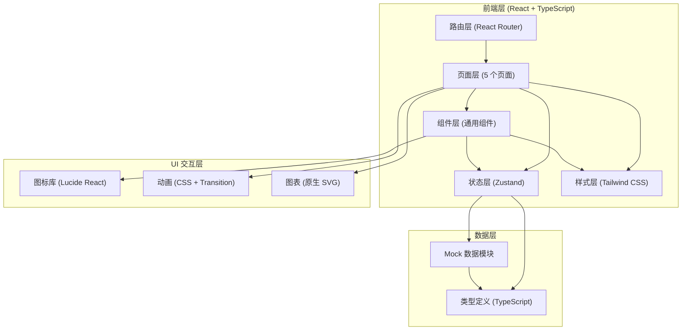

## 1. 架构设计



## 2. 技术描述
- 前端：React@18 + TypeScript + Vite@5
- 状态管理：Zustand（全局收藏、筛选、用户状态）
- 路由：React Router DOM@6
- 样式方案：Tailwind CSS@3 + CSS Variables
- 图标库：lucide-react
- 后端：无（纯前端 Mock 数据）
- 数据存储：LocalStorage（收藏持久化）

## 3. 路由定义
| 路由 | 页面 | 说明 |
|------|------|------|
| `/` | 资产地图页 | 首页，默认展示全部资产 |
| `/assets/:id` | 资产详情页 | 单个资产的完整信息展示 |
| `/lineage/:id` | 血缘视图页 | 展示资产上下游血缘关系 |
| `/ranking` | 使用排行页 | 访问热度、冷资产、统计图表 |
| `/applications` | 申请记录页 | 申请列表、提交申请、审批详情 |

## 4. 数据模型

### 4.1 核心数据类型
```typescript
// 敏感等级
type SensitivityLevel = 'high' | 'medium' | 'low' | 'public';

// 资产类型
type AssetType = 'table' | 'report' | 'api';

// 部门
interface Department {
  id: string;
  name: string;
  parentId: string | null;
}

// 主题域
interface Subject {
  id: string;
  name: string;
  icon: string;
}

// 数据负责人
interface Owner {
  id: string;
  name: string;
  avatar: string;
  department: string;
  email: string;
  phone: string;
}

// 字段定义
interface Field {
  name: string;
  type: string;
  description: string;
  sensitivity: SensitivityLevel;
  isPrimary?: boolean;
  isNullable?: boolean;
}

// 数据资产
interface DataAsset {
  id: string;
  name: string;
  type: AssetType;
  description: string;
  departmentId: string;
  subjectId: string;
  ownerId: string;
  sensitivity: SensitivityLevel;
  fields: Field[];
  createTime: string;
  updateTime: string;
  visitCount: number;
  lastVisitTime: string;
  rowCount?: number;
  isFavorite: boolean;
}

// 血缘节点
interface LineageNode {
  id: string;
  name: string;
  type: AssetType;
  layer: number;
}

// 血缘连线
interface LineageEdge {
  from: string;
  to: string;
}

// 血缘关系
interface LineageData {
  centerAssetId: string;
  nodes: LineageNode[];
  edges: LineageEdge[];
}

// 申请状态
type ApplicationStatus = 'pending' | 'approved' | 'rejected';

// 使用申请
interface Application {
  id: string;
  assetId: string;
  assetName: string;
  applicantId: string;
  applicantName: string;
  purpose: string;
  duration: string;
  submitTime: string;
  status: ApplicationStatus;
  approverId?: string;
  approverName?: string;
  approvalTime?: string;
  approvalComment?: string;
}
```

### 4.2 状态管理 (Zustand Store)
```typescript
interface AppStore {
  // 筛选状态
  searchKeyword: string;
  selectedDepartmentId: string | null;
  selectedSubjectId: string | null;
  selectedAssetType: AssetType | null;
  
  // 收藏
  favoriteIds: string[];
  toggleFavorite: (id: string) => void;
  
  // 申请记录
  applications: Application[];
  submitApplication: (data: SubmitAppData) => void;
  
  // 方法
  setSearchKeyword: (kw: string) => void;
  setSelectedDepartment: (id: string | null) => void;
  setSelectedSubject: (id: string | null) => void;
  setSelectedAssetType: (type: AssetType | null) => void;
}
```

## 5. 项目目录结构
```
src/
├── components/           # 通用组件
│   ├── Layout/          # 布局组件（导航栏、侧栏）
│   ├── AssetCard.tsx    # 资产卡片
│   ├── SearchBar.tsx    # 搜索栏
│   ├── CategoryTree.tsx # 分类树
│   ├── SensitivityBadge.tsx  # 敏感等级标签
│   ├── OwnerCard.tsx    # 负责人卡片
│   ├── FieldsTable.tsx  # 字段表格
│   ├── StatsCard.tsx    # 统计卡片
│   ├── StatusBadge.tsx  # 状态标签
│   └── Modal.tsx        # 通用模态框
├── pages/               # 页面组件
│   ├── AssetMap.tsx     # 资产地图
│   ├── AssetDetail.tsx  # 资产详情
│   ├── LineageView.tsx  # 血缘视图
│   ├── Ranking.tsx      # 使用排行
│   └── Applications.tsx # 申请记录
├── data/                # Mock 数据
│   ├── assets.ts        # 资产数据
│   ├── departments.ts   # 部门数据
│   ├── subjects.ts      # 主题数据
│   ├── owners.ts        # 负责人数据
│   ├── lineage.ts       # 血缘数据
│   └── applications.ts  # 申请数据
├── store/               # Zustand Store
│   └── useAppStore.ts
├── types/               # TypeScript 类型
│   └── index.ts
├── utils/               # 工具函数
│   └── format.ts
├── App.tsx              # 主路由入口
├── main.tsx             # 入口文件
└── index.css            # 全局样式 + Tailwind
```

